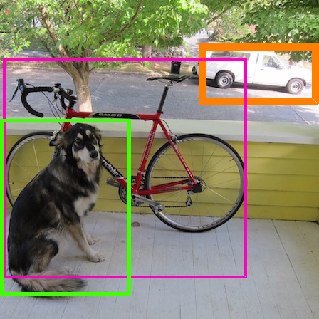
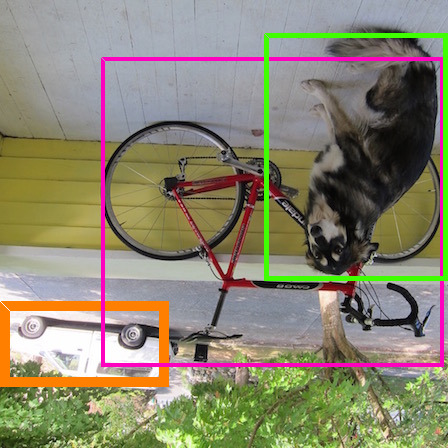

# RI-YOLO
Rotationally Invariant Yolo bounding boxes! 

This program will create additional datasets for yolo/SSD etc rotated 90, 180 and 270 degrees. It will create both the jpgs and
text files for the bounding boxes. 

To create even more datasets which take in additional orientations and spatial distortions, see Keras image data augmentation

https://blog.keras.io/building-powerful-image-classification-models-using-very-little-data.html

Hey a dog is still a dog even when upside down! And so is a bicycle!

Still a dog!

How to compile:

- Simply create a pycharm project and run "main.py"
